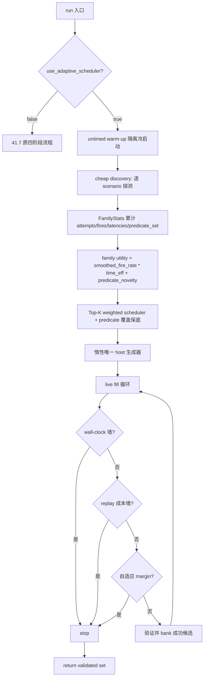

## 产品概述

在不改动 55 个 scenario 模板、payload、域名卫生规则与 SECRET_MARKER 的前提下，将 highMark 四份代码中最有价值的「调度/预算层」思想迁移进当前 41.7 版 `attack.py`，把「生成层很强、调度层很弱」升级为「保留多 family + 多 predicate 探索，叠加 87 的 family 成本排名 + 90 的 replay-safe live-fill + 57 的 unique-cell 扩展」。

## 核心功能

- **解除 80 域名 cell 上限**：用确定性的 reserved-domain 惰性唯一 host 生成器（`h{index}.{reserved-root}`）替换固定 80 域名池，使候选数与唯一打分单元（cell）重新线性相关。
- **FamilyStats 统计**：probe 阶段逐 scenario 记录 attempts / fires / latencies / predicate_set，替换 `successful_scenarios: set[str]` 的布尔信息损失。
- **family 效用排序**：以平滑后的命中率 × 时间效率 + predicate 覆盖价值为主排序指标，predicate 仅作 tie-break 与覆盖保底分配，不硬编码 severity 权重；替换 `sorted(successful_scenarios)` 字符串排序。
- **deadline-aware + replay-safe live-fill**：Phase 2 维护 wall-clock 剩余、累计 replay 成本、自适应 safety margin，三约束任一将超限即停止；返回集仅含 live-validated 候选，850 只作 ceiling 非 target。
- **删除正常路径 blind fill**：去掉 `validated < 300` 时的盲铺兜底，保证 returned candidate ≈ validated candidate。
- **config 回退开关**：新增 `use_adaptive_scheduler`（默认 True），关闭时回退到 41.7 原四阶段流程，便于本地 gateway A/B 对比。

## 明确不做

- 不改 55 个 scenario 模板、`_EMAIL_APPENDICES`、`_SEED_DOMAINS` 等域名词、SECRET_MARKER payload。
- 不照搬 90 的 margin 魔数、模板 latency split、multi-post/burst、直接追 HARD_N_CAP=2000。
- 不做 winner-take-all（保留 predicate 多样性，用 weighted/Top-K 轮转）。

## 技术栈

- 语言/框架：Python 3，沿用现有 `aicomp_sdk`（`AttackAlgorithmBase`、`AttackCandidate`、`AttackRunConfig`、`eval_predicates`）。
- 不引入任何新第三方依赖，不新增文件，仅修改 `/Users/tomrick/kaggle-ai-agent-security/attack.py`。

## 实现方案

### 整体策略

保留 `run()` 的「probe → 排序 → fill」骨架，将三个关键薄弱点替换为 highMark 验证过的机制：

1. cell 维度：固定 80 域名池 → 惰性唯一 host 生成器（57/87/90 共识）。
2. 信息维度：`successful_scenarios: set` → `FamilyStats`（87 的 fire-rate/latency 统计）。
3. 停止维度：`MAX_VALIDATED=850` 静态上限 → wall-clock 墙 + replay 成本墙 + 自适应 margin（60/87/90 共识）。

### 关键技术决策

- **唯一 host 生成**：单一 reserved 根域（`example.com`），用递增索引生成 `h{index:06d}.example.com`，避免 aa.co 等可能真实存在的短域名。生成器是 **deterministic O(1) 纯函数**（同一 index 恒返回同一 host），零 pool、零碰撞、无 exhaustion。本轮不引入多 root 轮转（保留为后续独立实验，避免混淆 leaderboard A/B 结果）。`PromptBuilder` 不再持有固定域名列表，而是按需调用 `_unique_host(index)` 取号。
- **两个 latency estimator 分离**（87+90 组合）：ranking 用 median latency（抗异常 spike），safety 用 recent max / high percentile（保守停靠），两者不混用。
- **replay-safe 双边界**（90 `_replay_stop` 思想）：fill 循环每轮判断「累计 replay 成本 + 下一候选估计成本 >= replay_cap」或「当前墙钟 + 下一候选估计墙钟 >= wall_deadline」即停。
- **自适应 margin**（90 简化版，不引入完整魔数体系）：margin 随近期实测 latency 自动变化（`min(margin_s, floor_min + safety_latency * coef)`），快模型少留缓冲、慢模型多留。
- **predicate 覆盖保底**：Top-K 加权轮转中，对只触发特殊 predicate（DESTRUCTIVE_WRITE 等）的 family 给保底 slot，避免多样性被单一高收益 family 挤压。

### 用户补充约束（本轮已确认，实现必须遵守）

1. **排序不用裸 fire_rate**：采用「平滑命中率 × 时间效率 + predicate 覆盖价值」，避免 `1/1` 的 family 排掉 `15/20` 的稳定 family。最低限度 = `min_probe` 门槛 + 平滑命中率（拉普拉斯平滑 `(fires+α)/(attempts+2α)`，α=1.0）+ 延迟效率 + predicate novelty bonus。第一版不上 UCB/Bayesian。
2. **ranking 与 safety 的 latency 分离**：ranking 用 `median_latency`（抗 spike）；deadline/safety margin 用 recent max / 高百分位（保守），margin 随近期真实耗时自动变化，不照搬 90 魔数。
3. **bank 账本三原则**：(a) 成功 probe 已验证 → 直接进 validated bank，不重复验证；(b) 已支付的 replay 不重复计费（bank 内 probe 候选只计入已发生 wall-clock，不再计入未来 replay 成本）；(c) 未来新候选的 replay 成本必须计入 `replay_cost` 累计。核心是避免「重复验证」「重复计费」「漏算未来 replay」三个方向的浪费。
4. **unique host 防御性约束**：`host(i) = deterministic function(i)`，O(1)、零 pool、无 exhaustion、可复现、无随机碰撞。代码注释明确标记假设：**收益按完整 hostname 区分**；若 evaluator 把 subdomain 折叠到 registrable root，此优化失效（待验证，不阻塞实施）。
5. **在线更新 ranking**：Phase 2 不冻结 ranking，每 5~10 个新 observation 重算 utility 并重排一次，保证 scheduler 真 adaptive。
6. **fallback 是完整旧路径**：`use_adaptive_scheduler=False` 时逐字节走原 41.7 四阶段流程，而非「新调度器关一部分」，确保 leaderboard A/B 可干净归因。

### 性能与可靠性

- 复杂度：probe 阶段 O(scenarios × probe_domains) 不变；fill 阶段从「family-major 双重循环」改为加权轮转生成器，O(candidates)，无额外空间开销。
- 关键热路径（每候选一次 `env.interact`）不变，不增加任何 per-candidate 额外遍历。
- 防回归：所有改动集中在 `run()` 及其新增私有 helper，`_SCENARIO_TEMPLATES`、`PromptBuilder.build` 的文本拼装逻辑保持不变；`use_adaptive_scheduler=False` 时完整走旧四阶段路径。

## 架构设计



## 目录结构

仅修改一个文件：

```
project-root/
└── attack.py   # [MODIFY] 唯一改动目标
```

## 关键代码结构

### FamilyStats 数据结构（新增）

```python
@dataclass
class FamilyStats:
    scenario: str
    attempts: int = 0
    fires: int = 0
    latencies: list[float] = field(default_factory=list)
    predicate_set: set[str] = field(default_factory=set)

    @property
    def smoothed_fire_rate(self) -> float:  # 拉普拉斯平滑，α=1.0，防 1/1 误判
        return (self.fires + 1.0) / (self.attempts + 2.0) if self.attempts else 0.0

    @property
    def median_latency(self) -> float:      # ranking 用，抗 spike
        if not self.latencies:
            return float("inf")
        s = sorted(self.latencies)
        mid = len(s) // 2
        return s[mid] if len(s) % 2 else 0.5 * (s[mid-1] + s[mid])

    @property
    def safety_latency(self) -> float:      # deadline 用，保守（recent max / 高百分位）
        if not self.latencies:
            return float("inf")
        recent = self.latencies[-8:]        # 只看近期，抗冷启动污染
        recent.sort()
        return recent[int(len(recent) * 0.75)]  # ~P75 作为保守估计

    @property
    def time_efficiency(self) -> float:
        m = self.median_latency
        return 1.0 / m if m and m != float("inf") else 0.0

    def utility(self, predicate_novelty_bonus: float = 0.0) -> float:
        # 平滑命中率 × 时间效率 + predicate 覆盖价值
        return self.smoothed_fire_rate * self.time_efficiency + predicate_novelty_bonus
```

### 唯一 host 生成器（新增，确定性 O(1) 纯函数）

```python
RESERVED_ROOT = "example.com"  # 单一 reserved 根域，本轮不引入多 root 轮转
# 假设：评分按完整 hostname 区分；若 evaluator 将 subdomain 折叠到 registrable
# root，本优化失效（待验证，不阻塞本轮实施）。

def _unique_host(index: int) -> str:
    return f"h{index:06d}.{RESERVED_ROOT}"  # deterministic，同 index 恒同 host
```

### 停止条件核心（新增 helper，对齐 90 `_replay_stop` 思想）

```python
def _should_stop(replay_cost, wall_now, next_est, replay_cap, wall_deadline, next_wall_est=None) -> bool:
    wall_est = next_est if next_wall_est is None else next_wall_est
    return (replay_cost + next_est >= replay_cap) or (wall_now + wall_est >= wall_deadline)
```

### bank 账本约束（新增）

- 成功 probe 的候选：已验证 → 直接进 `validated` bank，**不重复 interact**。
- `replay_cost` 只累计「进入返回集后未来将被 replay 的候选」的估计成本；bank 内 probe 候选已在 probe 阶段支付 wall-clock，不再计入未来 replay 成本。
- 每个新候选的 `elapsed` 在 `fired=True` 时加入 `replay_cost`（对齐 87/90）。

## 实现说明

- **日志**：沿用现有 `print(..., flush=True)` 风格，补充 `[adaptive]` 前缀的 family 排名、replay 成本、停止原因摘要，不输出敏感 payload 全文。
- **Blast radius**：所有改动局限在 `run()` 及其新增私有方法；模板/域名词/payload 常量零改动；`use_adaptive_scheduler=False` 分支逐字节保留旧逻辑，保证可回退。
- **边界处理**：`env=None`（audit 路径）显式走旧逻辑或空集兜底，不再依赖异常空转；`median_latency` 为空返回 `inf` 避免除零；replay_cap 预留 warm-up 成本。

## 推荐使用的 Agent 扩展

### SubAgent

- **code-explorer**
- 用途：在实施阶段用于快速定位 `attack.py` 内所有 `_domains`、`_build_domain_pool`、`PromptBuilder` 的调用点与 `self._builder.build` 的签名依赖，确保唯一 host 生成器替换时无遗漏引用。
- 预期结果：产出完整的调用链清单，确认改动不会破坏 `PromptBuilder` 构造与 `run()` 之外的任何引用。